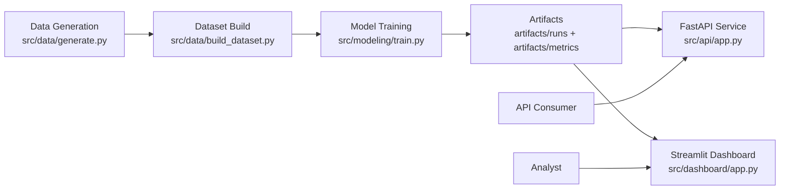
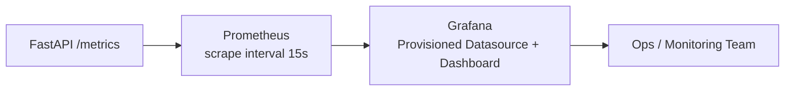
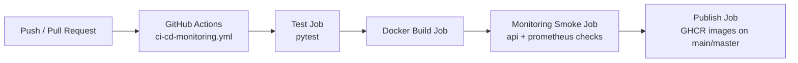

# FinSentry AI

Production-style machine learning system for real-time card fraud detection and merchant risk scoring, with API observability and CI/CD.

## Badges

[](#)
[](#)
[](#)
[](#)
[](#)
[](#)
[](#)
[](#)
[](LICENSE)

## Architecture Diagrams

### System Architecture



### Observability Architecture



### CI/CD and Delivery Flow



## What This Repository Includes

- Synthetic data generation and dataset build pipelines
- Fraud model training and evaluation artifacts
- FastAPI inference service (`/health`, `/runs`, `/load`, `/predict`, `/metrics`)
- Streamlit dashboard for run monitoring and batch scoring
- Docker Compose stack with:
  - API
  - Dashboard
  - Prometheus
  - Grafana
- GitHub Actions CI/CD pipeline:
  - test
  - docker build
  - monitoring smoke tests
  - image publish to GHCR

## Repository Layout

- `src/data/`: data generation and dataset assembly
- `src/features/`: preprocessing
- `src/modeling/`: training, evaluation, reason codes, merchant risk
- `src/api/`: FastAPI app and serving logic
- `src/dashboard/`: Streamlit dashboard
- `configs/`: configuration
- `docker/`: Dockerfiles, Compose, Prometheus and Grafana config
- `k8s/`: Kubernetes manifests
- `artifacts/`: runs, metrics, model outputs

## Quick Start with Docker (Recommended)

Prerequisites:

- Docker Engine
- Docker Compose plugin

From repo root:

```bash
docker compose -f docker/docker-compose.yml up --build -d
```

Services:

- API: `http://localhost:8000`
- API docs: `http://localhost:8000/docs`
- API metrics: `http://localhost:8000/metrics`
- Dashboard: `http://localhost:8501`
- Prometheus: `http://localhost:9090`
- Grafana: `http://localhost:3000` (default `admin` / `admin`)

Stop:

```bash
docker compose -f docker/docker-compose.yml down -v
```

## Observability and Monitoring

### Prometheus Metrics Exposed by API

- `fraud_api_http_requests_total{method,path,status_code}`
- `fraud_api_http_request_duration_seconds`
- `fraud_api_predictions_total{result}`
- `fraud_api_prediction_duration_seconds`

### Prometheus Configuration

- File: `docker/prometheus/prometheus.yml`
- Scrapes API metrics from `api:8000/metrics`

### Grafana Provisioning

- Datasource provisioning: `docker/grafana/provisioning/datasources/datasource.yml`
- Dashboard provisioning: `docker/grafana/provisioning/dashboards/dashboards.yml`
- Preloaded dashboard JSON:
  - `docker/grafana/dashboards/fraud-api-monitoring.json`

Dashboard panels include:

- Request rate by path
- HTTP P95 latency
- Prediction outcomes
- 4xx/5xx error rates

## Local Python Workflow (Without Docker)

```bash
python -m venv .venv
source .venv/bin/activate  # Windows PowerShell: .venv\Scripts\Activate.ps1
pip install -U pip
pip install -r requirements.txt
pip install -e .
```

Run full pipeline:

```bash
python -m src.data.generate --config configs/config.yaml
python -m src.data.build_dataset --config configs/config.yaml
python -m src.modeling.train --config configs/config.yaml
uvicorn src.api.app:app --host 0.0.0.0 --port 8000 --reload
streamlit run src/dashboard/app.py
```

## API Endpoints

- `GET /health`: service health and latest run id
- `GET /runs`: available run ids
- `POST /load?run_id=<run_id>`: load selected run (or latest)
- `POST /predict`: score one transaction payload
- `GET /metrics`: Prometheus metrics endpoint

Example request:

```bash
curl -X POST "http://localhost:8000/predict" \
  -H "Content-Type: application/json" \
  -d '{
    "data": {
      "amount_usd": 725.0,
      "channel": "online",
      "merchant_country": "NG",
      "mcc": "7995",
      "card_present": 0,
      "is_night": 1,
      "card_txn_count_15m": 3,
      "merchant_txn_count_1h": 24,
      "distance_from_home_km": 180.0
    }
  }'
```

## CI/CD with GitHub Actions

Workflow file:

- `.github/workflows/ci-cd-monitoring.yml`

Jobs:

- `test`: install deps and run `pytest`
- `docker-build`: build API and dashboard images
- `monitoring-smoke`: start `api + prometheus`, verify:
  - `/metrics` responds
  - Prometheus target health is `up`
- `publish-images`: on push to `main`/`master`, publish to GHCR:
  - `ghcr.io/<owner>/<repo>/fintech-risk-api`
  - `ghcr.io/<owner>/<repo>/fintech-risk-dashboard`

## Kubernetes Deployment

Use manifests in `k8s/`.

Build images:

```bash
docker build -f docker/Dockerfile.api -t fintech-risk-api:latest .
docker build -f docker/Dockerfile.dashboard -t fintech-risk-dashboard:latest .
```

Apply:

```bash
kubectl apply -k k8s/
kubectl -n fintech-risk get pods,svc,pvc,ingress
```

Port-forward:

```bash
kubectl -n fintech-risk port-forward svc/fraud-api 8000:8000
kubectl -n fintech-risk port-forward svc/fraud-dashboard 8501:8501
```
